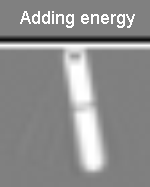

Hamiltonian Neural Networks
=======
Sam Greydanus, Misko Dzamba, Jason Yosinski | 2019

Basic usage
--------

To train a Hamiltonian Neural Network (HNN):
 * Task 1: Ideal mass-spring system: `python3 experiment-spring/train.py --verbose`
 * Task 2: Ideal pendulum: `python3 experiment-pend/train.py --verbose`
 * Task 3: Real pendulum (from this [Science](http://science.sciencemag.org/content/324/5923/81) paper): `python3 experiment-lipson/train.py --verbose`
 * Task 4: Two body problem: `python3 experiment-orbits/train.py --verbose`
 * Task 5: Pixel pendulum (from OpenAI Gym): `python3 experiment-pixels/train.py --verbose`

To analyze results
 * Task 1: Ideal mass-spring system: [`analyze-spring.ipnyb`](analyze-spring.ipynb)
 * Task 2: Ideal pendulum: [`analyze-pend.ipnyb`](analyze-spring.ipynb)
 * Task 3: Real pendulum: [`analyze-lipson.ipnyb`](analyze-spring.ipynb)
 * Task 4: Two body problem: [`analyze-pixels.ipnyb`](analyze-spring.ipynb)
 * Task 5: Pixel pendulum: [`analyze-pixels.ipnyb`](analyze-spring.ipynb)

Summary
--------

Even though neural networks enjoy widespread use, they still struggle to learn the basic laws of physics. How might we endow them with better inductive biases? In this paper, we draw inspiration from Hamiltonian mechanics to train models that learn and respect conservation laws in an unsupervised manner. We evaluate our models on problems where conservation of energy is important, including the chaotic three-body problem and pixel observations of a pendulum. Our model trains faster and generalizes better than a baseline network. An interesting side effect is that our model is perfectly reversible in time.

 * [Planning doc](https://docs.google.com/document/d/1WLprq600etYrqc51GLm5uTd2sTBeMYB5MUakJigCSEw/edit)
 * [Shared folder](https://drive.google.com/open?id=1869p7KJfOV5rI5HflTb7DmdnuSNbMyFU)

The HNN recipe
--------

1. Make a dataset of pixel-space observations of a physical system where energy is conserved. Here we're working with a pendulum.

2. Train an autoencoder on the dataset. The autoencoder is a bit unusual: its latent representation gets fed to the HNN, which tries to model the system's dynamics in latent space.

3. Since the HNN uses the latent representation to model dynamics, we can think of the latent factors as being analogous to canonical coordinates (e.g. position and velocity).

4. [Phase space plots](https://en.wikiversity.org/wiki/Advanced_Classical_Mechanics/Phase_Space) are a common way to visualize Hamiltonians. We can make a phase space plot in the autoencoder's latent space. We can also integrate along the energy contours of phase space to predict the dynamics of the system (in the figure below, we intentionally "add energy" halfway through).

5. After integrating in latent space, we can project back into pixel space to simulate the dynamics of the system.

Here's what it looks like when we add energy halfway through the simulation:

Modeling larger systems
--------

We can also model larger systems -- systems with more than one pair of canonical coordinates. The two-body problem, for example, has four coordinate pairs.

Numbers
--------

### Train loss
* Choose data of the form `x=[x0, x1,...]` and `dx=[dx0, dx1,...]` where `dx` is the time derivative of `x`
* Let `dx' = model.time_derivative(x)`
* Compute L2 distance between `dx` and `dx'`

|               | Baseline NN 			| Hamiltonian NN 	|
| ------------- 	| :-------------------: | :---------------: |
| Ideal mass-spring |  	3.7122e-02    	| 3.6927e-02 			|
| Ideal pendulum 	|   3.2606e-02  	| 3.2787e-02 		|
| Real pendulum 	|   1.9442e-03   	| 9.1546e-03 		|
| Two body problem 	|   2.6450e-05  	| 2.8388e-06		|
| Pixel pendulum 	|   2.9778e-04   	| 4.3140e-04 	 	|

### Test loss
Do the same thing with test data

|               	| Baseline NN 			| Hamiltonian NN 	|
| ------------- 	| :-------------------: | :---------------: |
| Ideal mass-spring |  	3.6656e-02    	  	| **3.5920e-02** 	|
| Ideal pendulum 	|   3.5273e-02 			| **3.5586e-02** 	|
| Real pendulum 	|   3.2514e-01   		| **3.2400e-01** 	|
| Two body problem 	|   2.9575e-05  	 	| **2.8838e-06** 	|
| Pixel pendulum 	|   4.3923e-04   		| **3.5081e-04**  	|

### Energy MSE
* Choose a trajectory `[x0, x1,...]` from test data
* Use RK4 integration to estimate `[x0', x1',...]` using the model
* Compute the L2 distance between `[energy(x0), energy(x1),...]` and `[energy(x0'), energy(x1'),...]`

|               	| Baseline NN 			| Hamiltonian NN	|
| ------------- 	| :-------------------:	| :---------------:	|
| Ideal mass-spring | 1.7077e-01			| **3.8119e-04** 	|
| Ideal pendulum 	| 4.1537e-02			| **2.4852e-02** 	|
| Real pendulum 	| 3.7144e-01			| **1.2468e-02**	|
| Two body problem 	| 5.933e-02   			| **3.870e-05** 	|
| Pixel pendulum 	| 9.3841e-03   			| **1.0049e-04** 	|

Dependencies
--------
 * OpenAI Gym
 * PyTorch
 * NumPy
 * ImageIO
 * Scipy

Known issues
--------
 * None so far \m/